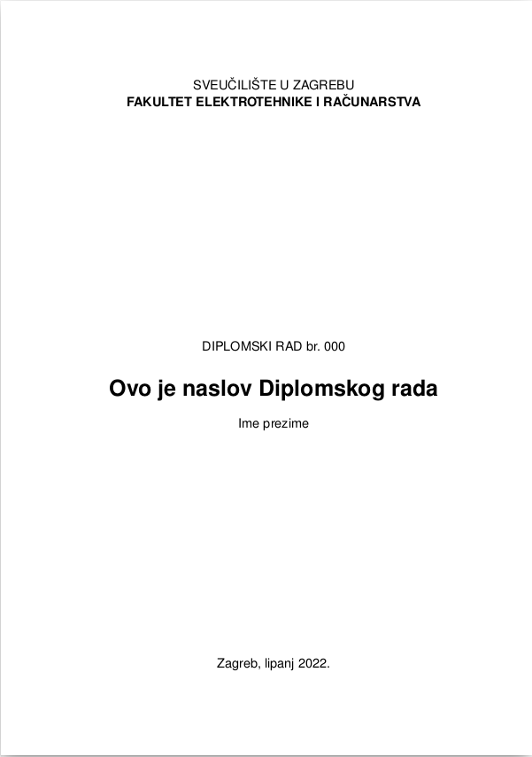
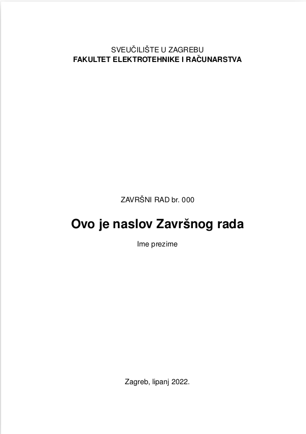
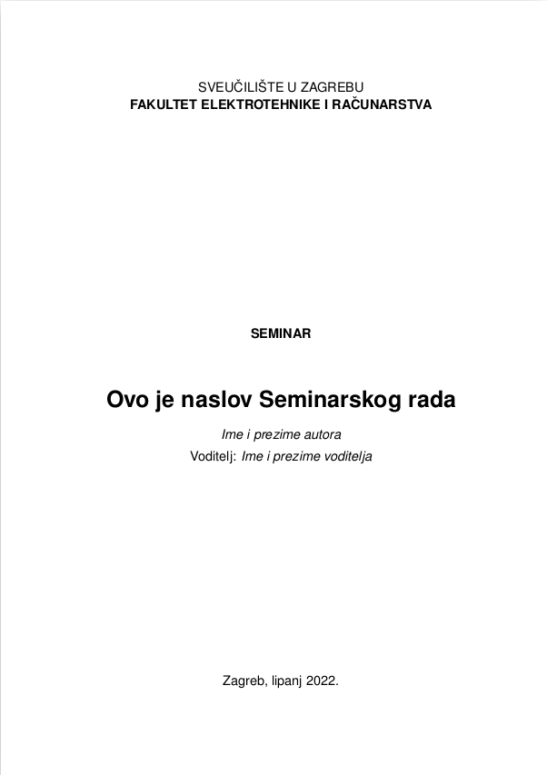

# Predlozak za Diplomski, Zavrsni ili Seminarski rad

<p align="middle">
  
   
  
</p>

## About
Ovo je projekt koji sadrzi predlozak (template) u Latexu za Diplomski, Zavrsni ili Seminarski rad.
Idealno za brzo pisanje i jednostavno pretvaranje u PDF.

## Installing
```
NOTE: Recommended OS for developing is Ubuntu 21.10 (also Ubuntu 20.04).
```
1. (recommended) Fork and clone the repository and `cd` into project root directory.
    - or if you don't know Git, download files [here](https://github.com/IvanVnucec/predlozak-za-diplomski-zavrsni-ili-seminarski-rad/archive/refs/heads/master.zip)
2. If on Ubuntu run `sudo make install` to install LaTex tools, 
    - otherwise, install [MiKTeX](https://miktex.org/).

## Writing
1. Make changes in `rad.tex` and `literatura.bib`, other files leave unchanged. 
    - For template usage see [Help](##Help).

## Building
1. Run `make build` to build PDF document in `build/rad.pdf`.
2. (optional) If you fork the repository, check out GH Actions: on every push
GH Actions will build the LaTex document and upload it as Actions build artifact.


## Testing
```
NOTE: for developers only.
```
To test if all the templates are valid, run `make test`. This command will create test folder under `build/tests` and it
will try to build all the templates into its own subdirectories.

## Files
```
.
├── .github             - direktorij za GitHub Actions
├── build               - direktorij sa build artefaktima (ukljucujuci .pdf)
├── docs                - direktorij sa LaTex template uputama
├── templates           - direktorij sa LaTex template-ovima (ne modificiraj ako ne moras) 
├── enumitem.sty        - dodatan paket za LaTex (ne modificiraj)
├── literatura.bib      - ovdje su citati (ovo modificiraj)
├── Makefile            - omogucuje instaliravanje alata, buildanje PDF dokumenta
├── rad.tex             - ovdje je rad (ovo modificiraj)
├── README.md           - Readme file
└── tocbibind.sty       - dodatan paket za LaTex (ne modificiraj)
```

## Help
For Latex Template help see [docs/LaTeX_template_upute.pdf](docs/LaTeX_template_upute.pdf).

## References
LaTex Predlozak i Upute smo preuzeli sa FER-ove stranice i blago modificirali (vidi git log).
